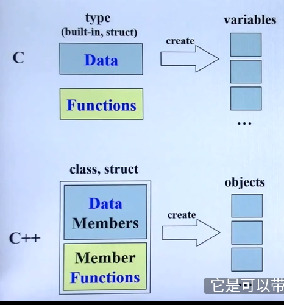

## 侯捷C++课程笔记

### 1. Introduction

* C与C++的不同：对待数据与函数的方式不同。在c中变量一般是全局的


* 两种主要的c++ class: object based类型(complex)与类型object oriented(string). string类型是一个指针


### 2. 头文件与类
* 头文件：防卫式声明(guard), #ifndef ... #define #endif
* inline function: 函数若在class body内定义完成，便**自动**成为inline候选人。若要在class body外定义inline
function, 需要在函数名称前加关键字**inline**
* access level(访问等级)：public, private. 一般数据是private, 函数是public
* **constructor(构造函数)：** 函数名称跟类的名称一样，无返回值；与其他函数相比，其有初始化列表；
constructor可以有很多个，overloading(重载); 
* **const** member functions(常量成员函数)：e.g. `double real () const {return re;}`。
作用--只会读取数据，不会修改数据。const修饰函数放在()后，修饰变量或实例放在前面
* 参数传递：值传参、引用传参和指针传参。引用传参的速度与指针传参差不多快（底层都是传指针），但形式更好看。
**尽量都使用引用传参**； pass by reference to const,使用常量引用传参，const的作用是不能修改所传参数
* friend(友元)： 友元可以获取class中的private内容，但这样会打破class的封装;相同class
的各个objects互为friends(友元)
#### 好的的class该咋写：
>* 数据放在private中，函数放在public
>* 尽可能使用引用传参
>* 返回值尽量使用引用返回
>* 应该加const的就要加
>* 构造函数constructor尽量使用初始化列表

#### 操作符重载-1，成员函数(operator overloading, this)
```c++
inline complex& complex::operator += (const complex& r){
    return __doapl(this,r)
}
```
#### 操作符重载-2，非成员函数(operator overloading, 无this)
```c++
inline complex operator + (const complex& x,const complex& y){
    return complex (real(x)+real(y), imag(x)+imag(y));
}
```
#### temp object(临时对象), typename()
`complex (real(x)+real(y), imag(x)+imag(y))`就是一个临时对象，其生命到下一行就结束

#### 构造函数、析构函数
析构函数要delete动态分配的内存

#### 三大函数：拷贝构造函数、拷贝赋值函数、（以string为例子）
深拷贝与浅拷贝

### 3. 堆(stack),栈(heap)与内存管理
* 栈区存放函数的参数值，局部变量的值等;堆区存放new实例 
* new与delete成对使用
* new的时候，先分配memory再调用constructor
* 