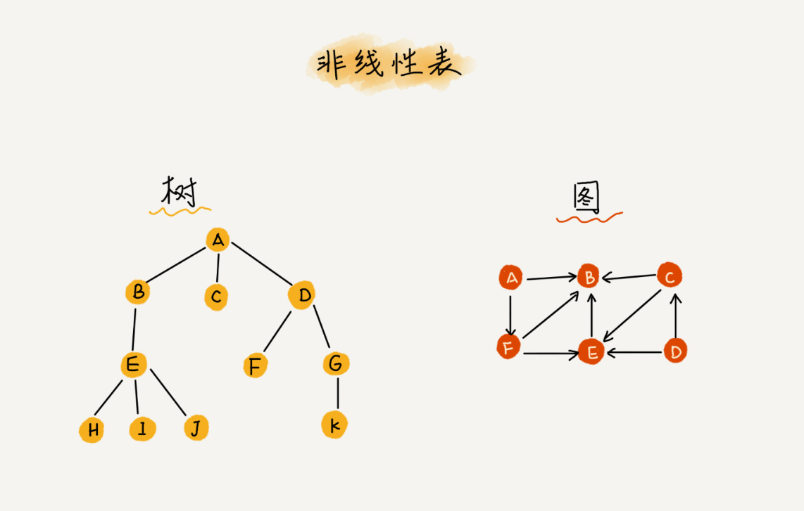

# 数据结构学习笔记

[电子书：力扣加加－努力做西湖区最好的算法题解](https://leetcode-solution-leetcode-pp.gitbook.io/leetcode-solution/)

##分类
从逻辑上，数据结构可分为**线性结构**和**非线性结构**
>* 线性结构：数组、栈、链表等
>* 非线性结构：树、图等

## 线性表(Linear List)
* 定义：由**同种类型数据元素**构成**有序序列**的线性结构


* 数组(Array)：用一组**连续的内存空间**，来存储一组具有**相同类型**的数据。
  [参考](https://www.cnblogs.com/fengxiaoyuan/p/10934399.html)
* 链表(Linked List)：一种递归的数据结构，它或者为空（null），或者是指向一个结点（node）的引用，
  该节点还有一个元素和一个指向另一条链表的引用。
  [参考](https://www.cnblogs.com/fengxiaoyuan/p/10940845.html)
* 数组属于顺序存储，链表属于链式存储。顺序存储是指在物理空间上顺序存储
* 从根本上来说，各种数据结构的底层都是数组或链表
  
  
* 堆栈(Stack):具有一定操作约束的线性表，后入先出。
* 用途：函数调用、递归、表达式求值等
* 操作：入栈(Push);出栈(Pop)
* 栈的顺序存储实现：由一个一维数组和一个记录栈顶元素位置的变量组成
```c++
#define Maxsize  //存储数据元素的最大个数
typedef struct SNode *Stack;
struct SNode{
    ElementType Data[Maxsize];
    int top;
};
```
* 栈的链式存储实现:栈顶指针Top应该指向表头
```c++
typedef struct SNode *Stack;
struct SNode{
    ElementType Data;
    struct SNode *Next;
};
```

* 队列(Queue)：具有一定操作约束的线性表，先进先出。
* 操作：入队(AddQ);出队(DeleteQ)
* 队列的顺序存储实现：由一个一维数组和队头元素位置变量front和队尾元素位置变量rear组成
```c++
#define Maxsize  //存储数据元素的最大个数
struct QNode{
    ElementType Data[Maxsize];
    int rear;
    int front;
};
```
* 环形队列：最好只用n-1个位置。否则，在front==rear时，无法判断队列大小
  
* 队列的链式存储实现
```c++
struct Node{
    ElementType Data;
    struct SNode *Next;
};
struct QNode{  //链队列结构
    struct Node *rear;  //指向队尾节点
    struct Node *front;  //指向队头节点
};
typedef struct QNode *Queue;
Queue PtrQ; 
```

## 非线性表(Nonlinear List)


